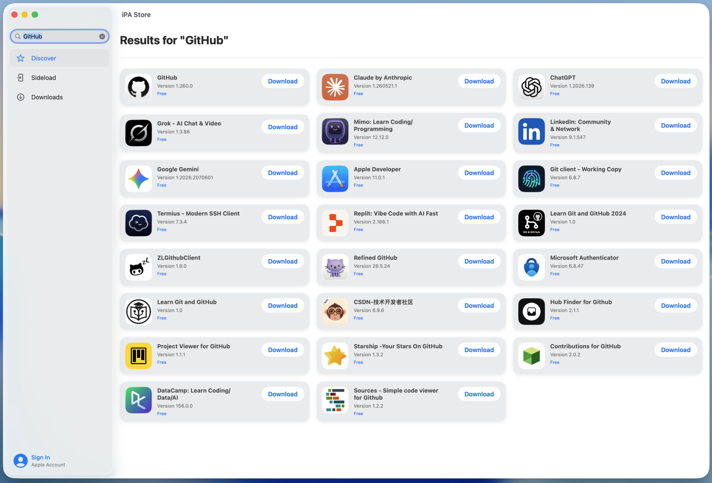
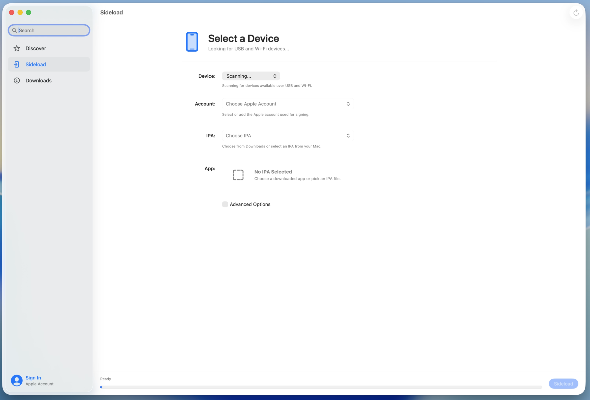

# iPA Store

A modern SwiftUI macOS app for searching the App Store, downloading and exporting apps as IPA files, and soon sideloading IPAs to connected devices without Terminal or command-line tools.

> **Status:** This project is still under development. IPA search, download, and export are working. Sideloading is currently in progress.

---

## Preview

### App Store Search & IPA Downloads

### Sideloading Interface

---

## About

iPA Store is a native macOS app built with **Swift** and **SwiftUI**. It is designed to make IPA downloading, exporting, and sideloading easier through a clean Apple-style interface.

Instead of using Terminal commands or outdated sideloading tools, iPA Store brings everything into one simple desktop app. Users can sign in, search for apps from the App Store, download them as IPA files, export those IPAs, and eventually sideload them directly to their iPhone or iPad.

---

## Features

### Working

- Native macOS app built with Swift and SwiftUI
- Sign in with an Apple account
- Search for apps from the App Store
- View app results with icons, versions, and download buttons
- Download apps as IPA files
- Export downloaded IPA files
- Modern macOS-style sidebar and interface

### In Progress

- Detect connected iPhone and iPad devices
- Select an Apple account for signing
- Choose downloaded or local IPA files
- Sideload IPAs directly to connected devices
- Advanced sideloading options

---

## Motivation

I started this project because most IPA downloading and sideloading tools feel too technical, outdated, or unfriendly for regular users.

The goal of iPA Store is to create a more modern, polished, and Apple-friendly tool that combines IPA downloading and sideloading in one place.

---

## Tech Stack

- Swift
- SwiftUI
- macOS
- App Store search/download logic
- IPA export system
- Device sideloading system

---

## Project Status

This app is not fully complete yet.

The current working features include searching the App Store, downloading IPA files, and exporting them. The sideloading feature is partially implemented and still being worked on.

---

## License

This project is licensed under the MIT License.
